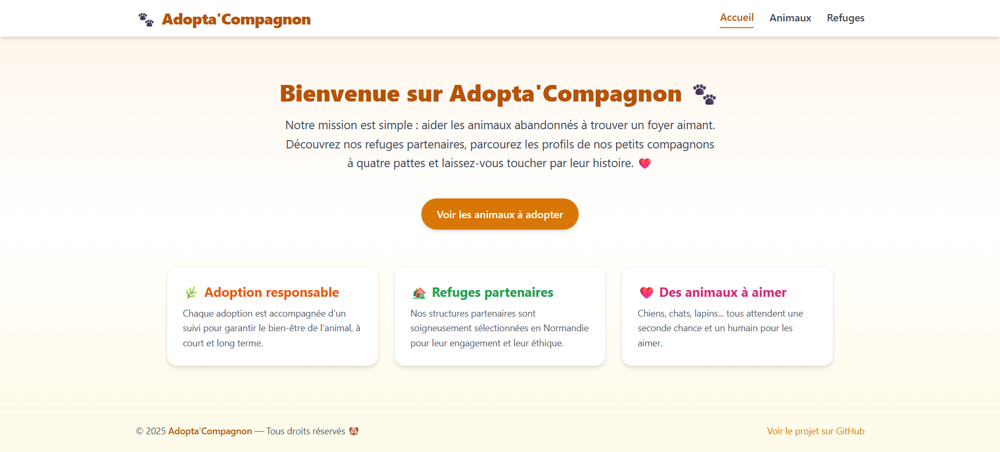
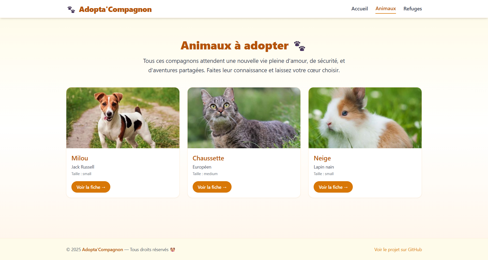
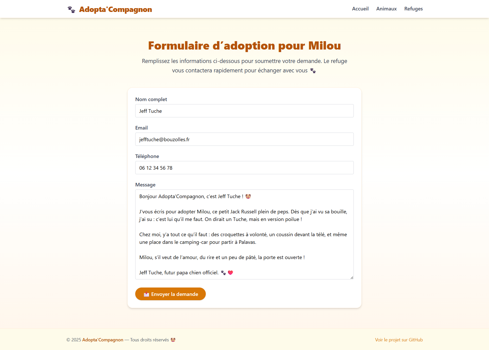
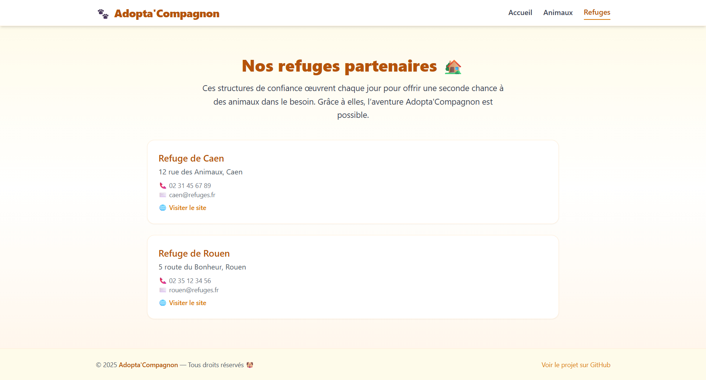

# 🎨 Adopta'Compagnon – Frontend Vue.js

Bienvenue dans le dépôt **frontend** de l’application **Adopta'Compagnon**, développée avec **Vue.js** + **TailwindCSS**.
Ce frontend permet à l'utilisateur de consulter les animaux disponibles à l’adoption, visualiser les refuges, et envoyer une demande d’adoption via une API Strapi.

---

## 🚀 Lancer le projet en local

1. Cloner le dépôt :
```bash
git clone https://github.com/Tom-Dln/adopta-frontend.git
cd adopta-frontend
```

2. Installer les dépendances :
```bash
npm install
```

3. Lancer l’application :
```bash
npm run dev
```

L’application sera disponible par défaut à l’adresse :  
👉 `http://localhost:5173`

---

## 🗂️ Structure du site (Vue 3 + Composants)

### 🧱 Pages principales

| Page              | Route                  | Description                                               |
|-------------------|------------------------|-----------------------------------------------------------|
| Accueil           | `/`                    | Présentation de la plateforme                             |
| Animaux           | `/animals`             | Liste des animaux disponibles                             |
| Détail Animal     | `/animals/:documentId` | Fiche complète d’un animal                                |
| Formulaire        | `/adopt/:documentId`   | Formulaire d’adoption pour un animal                     |
| Refuges           | `/shelters`            | Liste des refuges partenaires                             |

### 🔧 Composants principaux

- `AnimalCard.vue` : carte individuelle d’un animal
- `AnimalDetail.vue` : affichage détaillé d’un animal
- `AdoptionForm.vue` : formulaire dynamique lié à un animal
- `Shelters.vue` : affichage des refuges
- `Loader.vue` : indicateur de chargement
- `Navbar.vue` / `Footer.vue` : structure générale de navigation

---

## 📊 Diagramme de classes (front)

```
+--------------------+
| AnimalCard.vue     |
+--------------------+
| Props: animal      |
| Affiche résumé     |
+--------------------+

+--------------------+
| AnimalDetail.vue   |
+--------------------+
| Params: documentId |
| Appel API / Détail |
+--------------------+

+--------------------+
| AdoptionForm.vue   |
+--------------------+
| Params: documentId |
| Formulaire / POST  |
+--------------------+

+--------------------+
| Shelters.vue       |
+--------------------+
| Appel API / Liste  |
+--------------------+
```

---

## 🎯 Cas d’utilisation (UML)

```
Acteur: Utilisateur

1. Arrive sur la page d’accueil
2. Consulte la liste des animaux
3. Clique sur un animal → ouvre sa fiche
4. Accède au formulaire → remplit et envoie la demande
```

---

## 🔁 Séquence (envoi de demande)

```
Utilisateur
   ↓
Vue (AdoptionForm.vue)
   ↓
POST /api/adoption-requests (Strapi)
   ↓
Confirmation → Message affiché
```

---

## 🔗 Routes front utilisées

| Route                         | Composant associé       |
|------------------------------|--------------------------|
| `/`                          | `Home.vue`              |
| `/animals`                   | `AnimalsList.vue`       |
| `/animals/:documentId`       | `AnimalDetail.vue`      |
| `/adopt/:documentId`         | `AdoptionForm.vue`      |
| `/shelters`                  | `Shelters.vue`          |

---

## 📸 Captures d'écrans

1. Accueil (`/`)

2. Liste des animaux (`/animals`)

3. Détail d’un animal (`/animals/:id`)

4. Formulaire rempli (`/adopt/:id`)

5. Liste des refuges (`/shelters`)


---

## 🧑‍💻 Technologies

- **Vue 3 + Composition API**
- **Vite** (serveur de dev)
- **TailwindCSS** pour le style
- **Axios** pour appels API

---

## 📝 Auteur

Tom Delaunay | MyDigitalSchool Caen | M2-DFS 2025
